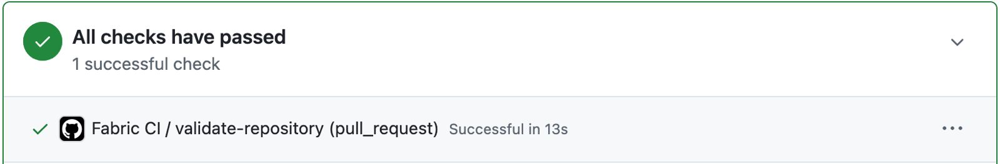
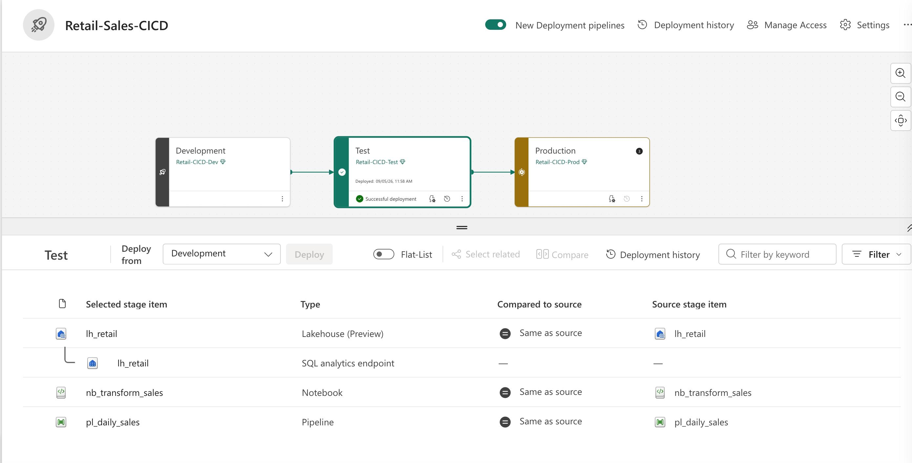
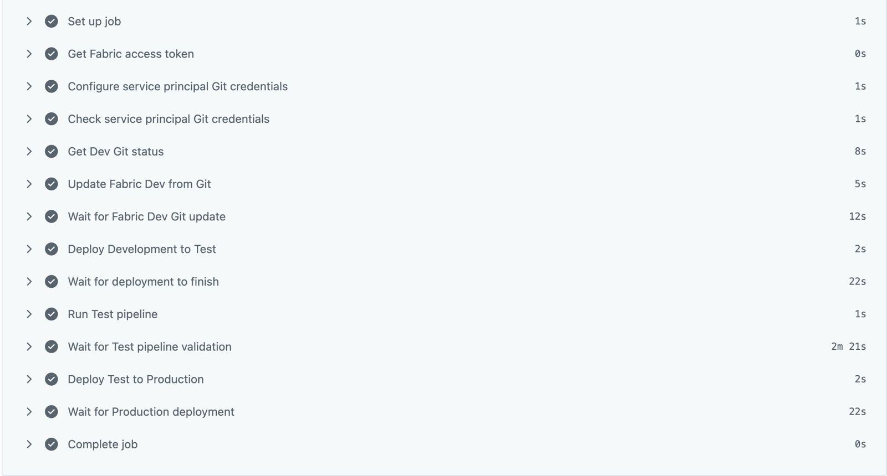
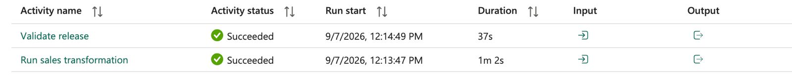
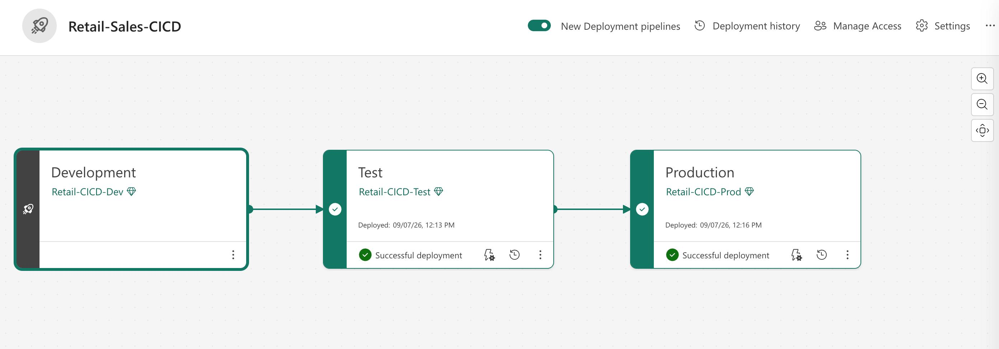

# Microsoft Fabric Retail Sales CI/CD Project

## Overview

This project demonstrates an end-to-end CI/CD workflow for a small Microsoft Fabric data engineering solution.

The primary goal is not to build a complex data architecture. Instead, the project demonstrates how a Microsoft Fabric data pipeline can be developed using feature branches, validated through pull requests and GitHub Actions, deployed across Dev/Test/Prod environments, and promoted to Production only after automated validation in the Test environment succeeds.

## Objective

Build a retail sales pipeline using Microsoft Fabric while practicing:

* Git source control
* Feature branch development
* Pull requests
* Automated CI validation
* Dev / Test / Prod environments
* Fabric Git integration
* Fabric Deployment Pipelines
* Automated deployment
* Post-deployment validation
* Release gating before Production

## Architecture

```text
CSV files
   ↓
Microsoft Fabric Data Pipeline
   ↓
Lakehouse Bronze
   ↓
PySpark transformation notebook
   ↓
Silver Delta table
   ↓
Gold KPI table
```

### Fabric Artifacts

The solution contains the following Microsoft Fabric artifacts:

* `lh_retail`
* `nb_transform_sales`
* `nb_validate_release`
* `pl_daily_sales`

The transformation process produces:

* `silver_sales`
* `gold_daily_sales`

The Silver layer includes calculated metrics such as:

* `gross_amount`
* `discount_amount`
* `net_revenue`
* `estimated_cost`
* `profit_amount`
* `profit_margin`

## Environments

The project uses three Microsoft Fabric workspaces:

* `Retail-CICD-Dev`
* `Retail-CICD-Test`
* `Retail-CICD-Prod`

The deployment flow is:

```text
GitHub main
    ↓
Retail-CICD-Dev
    ↓
Fabric Deployment Pipeline
    ↓
Retail-CICD-Test
    ↓
Fabric Deployment Pipeline
    ↓
Retail-CICD-Prod
```

The `main` branch in GitHub is the source of truth for the Dev workspace.

Test and Production are intentionally not connected directly to Git. Instead, artifacts are promoted from Dev to Test and from Test to Production using Fabric Deployment Pipelines.

This separates source control from environment promotion:

* GitHub controls version history and approved source changes.
* Fabric Git Integration synchronizes approved changes into Dev.
* Fabric Deployment Pipelines control promotion between Fabric environments.

## Branch Strategy

Development uses short-lived feature branches.

```text
main
  ↓
feature/add-profit-margin
  ↓
Pull Request
  ↓
CI validation
  ↓
Merge to main
```

Fabric notebook development follows the same model:

```text
Fabric Dev connected to feature branch
        ↓
Develop and test notebook
        ↓
Commit changes
        ↓
Open Pull Request
        ↓
CI passes
        ↓
Switch Fabric Dev back to main
        ↓
Merge Pull Request
```

This workflow allows Fabric development to follow the same Git review process as application code.

## CI Workflow

GitHub Actions runs Continuous Integration checks for pull requests targeting `main`.

CI validates:

* Repository structure
* Python business logic
* Profit calculations
* Edge cases
* Data-quality contracts
* Schema expectations
* Release-validation logic

Example unit-tested business logic includes:

* `gross_amount`
* `discount_amount`
* `net_revenue`
* `estimated_cost`
* `profit_amount`
* `profit_margin`

The CI workflow runs:

```bash
python -m pytest -q
```

CI validates repository structure, testable business logic, schema expectations, and release-validation logic before changes are merged.

Runtime validation against deployed Fabric artifacts occurs later in the Test environment and acts as the release gate for Production.

## CD Workflow

Continuous Deployment runs automatically after an approved change is merged into `main`.

```text
Merge to main
     ↓
GitHub Actions CD
     ↓
Authenticate to Microsoft Fabric
     ↓
Sync Fabric Dev from GitHub main
     ↓
Deploy Dev → Test
     ↓
Run Test pipeline
     ↓
Run release-validation notebook
     ↓
Validation PASS?
     │
     ├── No → Stop deployment
     │
     └── Yes
          ↓
Deploy Test → Production
```

GitHub Actions acts as the CD orchestrator.

Fabric Deployment Pipelines remain responsible for promoting Fabric artifacts between environments.

This provides a clear separation of responsibilities:

* GitHub Actions controls release orchestration.
* Fabric Git Integration synchronizes source-controlled artifacts into Dev.
* Fabric Deployment Pipelines promote artifacts between environments.
* Runtime validation in Test determines whether Production deployment is allowed.

## Authentication

GitHub Actions authenticates to Microsoft Fabric using a Microsoft Entra service principal.

Sensitive credentials are stored as GitHub Actions secrets:

* `AZURE_TENANT_ID`
* `AZURE_CLIENT_ID`
* `AZURE_CLIENT_SECRET`

Non-sensitive Fabric object IDs are stored as GitHub repository variables.

Examples include:

* `FABRIC_DEV_WORKSPACE_ID`
* `FABRIC_TEST_WORKSPACE_ID`
* `FABRIC_TEST_PIPELINE_ID`
* `FABRIC_DEPLOYMENT_PIPELINE_ID`
* `FABRIC_DEV_STAGE_ID`
* `FABRIC_TEST_STAGE_ID`
* `FABRIC_PROD_STAGE_ID`
* `FABRIC_GITHUB_CONNECTION_ID`

This keeps credentials out of the repository while allowing the deployment workflow to reference environment-specific Fabric resources.

## Automated Test Release Gate

After deployment to Test, GitHub Actions automatically runs `pl_daily_sales`.

The pipeline executes:

```text
nb_transform_sales
        ↓
nb_validate_release
```

The validation notebook checks conditions such as:

* `silver_sales` exists
* `gold_daily_sales` exists
* Expected Silver columns exist
* Invalid row count equals `0`
* Expected Test revenue equals `465.00`

If validation fails, the Fabric pipeline fails and GitHub Actions stops the release.

Production deployment occurs only after the Test validation gate succeeds.

This prevents an artifact from being promoted to Production simply because deployment itself succeeded. The deployed workload must also pass runtime validation.

## Repository Structure

```text
fabric-retail-cicd/
│
├── .github/
│   └── workflows/
│       ├── ci.yml
│       └── cd.yml
│
├── fabric/
│   ├── lh_retail.Lakehouse/
│   ├── nb_transform_sales.Notebook/
│   ├── nb_validate_release.Notebook/
│   └── pl_daily_sales.DataPipeline/
│
├── scripts/
│   └── validate_test_release.py
│
├── src/
│   ├── __init__.py
│   └── retail_logic.py
│
├── tests/
│   ├── fixtures/
│   ├── test_basic.py
│   ├── test_notebook_definition.py
│   ├── test_retail_logic.py
│   └── test_release_validation.py
│
├── docs/
│   └── images/
│
├── README.md
└── .gitignore
```

## Running Tests Locally

From the repository root, run:

```bash
python -m pytest -q
```

This executes the same core test suite used by the CI workflow.

## Failure Scenarios and Lessons Learned

Several real implementation problems were intentionally documented rather than hidden. They demonstrate issues that can occur when automating Microsoft Fabric deployments.

### 1. Delta Schema Evolution

Adding the following columns:

* `estimated_cost`
* `profit_amount`
* `profit_margin`

caused a Delta schema mismatch because the existing Silver table used the previous schema.

For this full-refresh pipeline, the solution was:

```python
.option("overwriteSchema", "true")
```

Schema changes are part of the data contract and must be handled explicitly.

For a full-refresh workload, overwriting the schema is appropriate when the new schema is intentionally controlled by the transformation process.

### 2. Python Import Failure in CI

GitHub Actions initially failed with:

```text
ModuleNotFoundError: No module named 'src'
```

The workflow was updated to run `pytest` with the repository root available on `PYTHONPATH`.

This highlighted an important difference between local development environments and CI runners:

> Local Python execution and CI environments may resolve imports differently.

CI configuration must therefore explicitly define the environment required by the test suite.

### 3. HTTP 411 When Calling Fabric

A Fabric Data Pipeline REST API call initially returned:

```text
411 Length Required
```

The POST request did not include a request body.

The request was corrected by sending an empty JSON object:

```bash
-d '{}'
```

This demonstrated that REST automation requires attention to HTTP request semantics, not only the API endpoint itself.

### 4. Service Principal Git Credentials

The service principal could authenticate successfully to Microsoft Fabric, but Fabric Git synchronization initially returned:

```json
{"source": "None"}
```

The GitHub connection had to be configured for the service principal using a configured Fabric connection.

This highlighted an important distinction:

> Fabric API authentication and Fabric Git authentication are separate concerns.

A service principal being authorized to call Fabric APIs does not automatically mean it can perform Git synchronization.

### 5. Git Update Override Protection

Fabric Git synchronization returned:

```text
OverrideItemsNotAllowed
```

The CD workflow was updated to include:

```json
{
  "options": {
    "allowOverrideItems": true
  }
}
```

Automated deployment should explicitly define which system is authoritative.

In this project, the merged GitHub `main` branch is the source of truth for the Dev workspace.

Allowing overrides enables the automated synchronization process to align the Dev workspace with the approved state stored in Git.

### 6. Merge Conflicts

During development, the CD workflow eventually produced a Git merge conflict in:

```text
.github/workflows/cd.yml
```

The conflict was manually resolved while preserving the required Fabric Git synchronization options.

This reinforced an important CI/CD principle:

> CI/CD configuration is production code and requires the same Git discipline as application or data-pipeline code.

Workflow definitions should therefore be reviewed, version-controlled, tested, and protected through the same pull-request process as other project code.

## CI/CD Responsibilities

Each platform has a clearly defined responsibility in the deployment architecture.

```text
GitHub
   ↓
Source control
Feature branches
Pull Requests
Version history

GitHub Actions CI
   ↓
Pre-merge automated testing

GitHub Actions CD
   ↓
Release orchestration

Fabric Git Integration
   ↓
Synchronize GitHub main into Dev

Fabric Deployment Pipelines
   ↓
Dev → Test → Production promotion

Fabric Test
   ↓
Runtime validation
Release gate

Fabric Production
   ↓
Released workload
```

### Responsibility Summary

| Component                   | Responsibility                                                |
| --------------------------- | ------------------------------------------------------------- |
| GitHub                      | Source control, branching, pull requests, and version history |
| GitHub Actions CI           | Pre-merge automated testing                                   |
| GitHub Actions CD           | Release orchestration                                         |
| Fabric Git Integration      | Synchronization of `main` into the Dev workspace              |
| Fabric Deployment Pipelines | Promotion from Dev → Test → Production                        |
| Fabric Test                 | Runtime validation and Production release gate                |
| Fabric Production           | Released production workload                                  |

## Release History

### v1.0.0 - Initial Retail Sales Pipeline

Initial data-processing architecture:

```text
CSV
 ↓
Bronze
 ↓
Silver
 ↓
Gold
```

Includes the initial Fabric Dev/Test/Prod deployment workflow.

### v2.0.0 - Automated Fabric CI/CD

Introduced the complete automated release process:

```text
Feature branch
      ↓
Pull Request
      ↓
CI
      ↓
Merge to main
      ↓
Fabric Git sync
      ↓
Dev
      ↓
Test
      ↓
Automated Test validation
      ↓
Production
```

Production deployment is blocked automatically when Test validation fails.

## Project Evidence

### Pull Request CI



### Fabric Deployment Pipeline



### Automated CD



### Automated Test Gate



### Production Deployment



## Skills Demonstrated

* Microsoft Fabric
* PySpark
* Delta Lake
* OneLake
* Fabric Data Pipelines
* Fabric Deployment Pipelines
* Fabric Git Integration
* GitHub
* GitHub Actions
* Git branching
* Pull Requests
* CI/CD
* Microsoft Entra service principals
* REST APIs
* Automated testing
* Data-quality validation
* Release validation
* Dev/Test/Prod environment promotion
* Automated Production release gating
